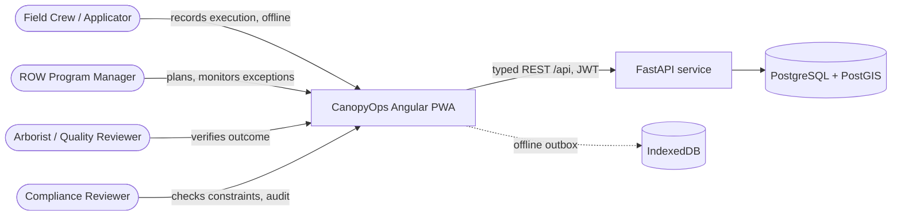
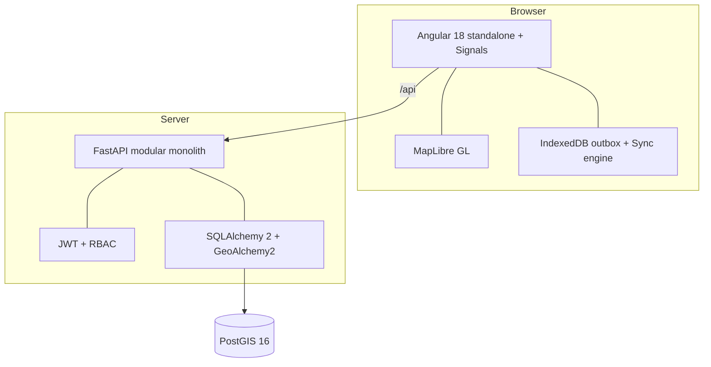
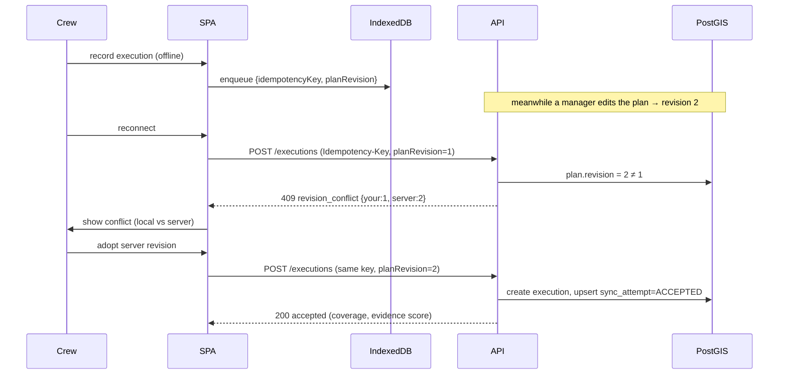

# Architecture

## 1. Problem statement

ROW managers, arborists, field crews, and quality reviewers need a reliable way to
prove that a vegetation intervention occurred in the intended place, under the
required constraints, with complete evidence — and later verify whether the
intended safety/clearance/plant-health outcome was achieved. Today that link
between *planned → applied → changed → next action* is easily lost, especially
across intermittent field connectivity.

## 2. System context (C4 level 1)



## 3. Container view (C4 level 2)



## 4. Critical sequence — offline execution → conflict → recovery



## 5. Data model

| Entity | Responsibility | Key fields |
|---|---|---|
| `corridor` | ROW circuit + span geometry | circuit_id, span_label, centerline (LINESTRING) |
| `work_order` | operational assignment | reference, priority, corridor_id, revision |
| `treatment_plan` | approved intent for an area | planned_geometry (POLYGON), target_condition, method_category, required_evidence, verification_policy, **revision** |
| `treatment_execution` | field record of what occurred | actual_geometry, coverage_ratio, local/server_revision |
| `evidence_item` | photo/measurement/note | type, upload_status, storage_key, checksum |
| `environmental_constraint` | spatial/procedural restriction | geometry (POLYGON), category, severity |
| `verification_observation` | follow-up result | conclusion, regrowth, compatible_cover, **followup_geometry** |
| `sync_attempt` | recoverable transport history | idempotency_key (unique per entity), status, error_code |
| `audit_event` | immutable business history | actor, action, before/after, correlation_id |

## 6. Treatment state machine

```
DRAFT → SCHEDULED → IN_PROGRESS → APPLIED → AWAITING_VERIFICATION
     → EFFECTIVE | PARTIALLY_EFFECTIVE | INEFFECTIVE | INCONCLUSIVE
     → FOLLOW_UP_PLANNED → CLOSED
```

Enforced in `app/models/enums.py::ALLOWED_TRANSITIONS`. Invariants: a plan can’t be
approved without geometry/outcome/evidence policy; execution can’t silently
overwrite an approved plan; a failed upload can’t mark evidence complete; a
verification conclusion must reference a human reviewer; every mobile mutation
carries a revision and idempotency key.

## 7. Architecture decision records

| # | Decision | Chosen | Rejected | Why |
|---|---|---|---|---|
| ADR-1 | App shape | Modular monolith | Microservices | Prototype scale doesn’t justify the ops overhead. |
| ADR-2 | Outcome logic | Deterministic rules + human conclusion | AI-generated verdict | Safety, auditability, domain uncertainty demand explainability. |
| ADR-3 | Offline writes | Local outbox + idempotent endpoint | Blind POST retry | Prevents duplicate execution/evidence records. |
| ADR-4 | Conflicts | Revision check → 409 for human resolution | Last-write-wins | Field truth vs. plan changes must be reconciled, not clobbered. |
| ADR-5 | Map data | GeoJSON + server-side spatial query | Load all features client-side | Scales; keeps low-power field devices responsive. |
| ADR-6 | UI kit | Tailwind + hand-built primitives (shadcn/Spartan aesthetic) | Full Nx + Spartan install | Same look, far less fragility; every component defensible. |
| ADR-7 | DB port | Host 5433 for the container | 5432 | Avoids collision with a native PostgreSQL install. |

## 8. Failure map

| Failure | Detection / UX | Recovery |
|---|---|---|
| Network loss during save | Draft + outbox item persisted locally; “saved locally” | Auto-retry on reconnect; manual retry available |
| Upload succeeds, API times out | Idempotency key → server returns existing result | No duplicate evidence record |
| Plan changed while crew offline | Revision conflict at sync | Show local vs server; require human resolution |
| Actual geometry partial | Coverage ratio computed | Record stays visibly incomplete |
| Verification overdue | Verification-debt queue | Escalate per synthetic policy; never silently close |
| Unauthorized action | Server 403 | UI explains required role |
| Persistent sync error | Bounded auto-retries (cap 4) + draining guard | No retry storm; manual retry stays available |
